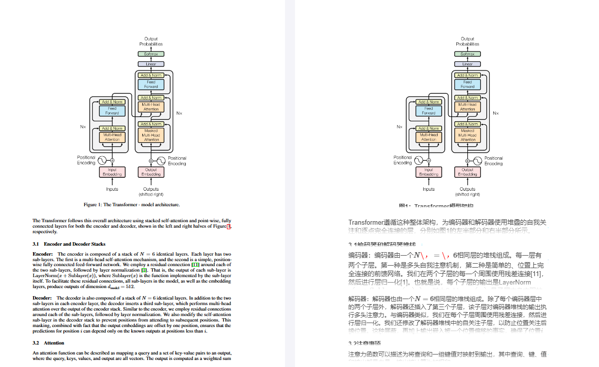

English | [简体中文](README_zh-CN.md)
# DocTranslaterAgent
Online simultaneous translation display of PDF, retaining the original text layout

## Preview


## Project Structure
- backend Backend project
  - python3.10
- web Frontend project
  - node > V16.3.0
  - npm > 7.15.1

## Core Code
- BaseReader--PDF text block reading
  - PdfDefaultTextReader (fastest): Default text type PDF reader, identifies text blocks based on YOLO, and obtains block text information through pdfminer
  - PdfDefaultOcrReader: Default image type PDF reader, identifies text blocks based on YOLO, and recognizes block text information through paddleocr
  - MinerUReader (recommended): Parses MinerU results, constructs block information (supports formula recognition, OCR result accuracy is relatively high)
    - MinerOcrUReader: Uses OCR parsing
    - MinerTextUReader: Text PDF parsing, skips OCR steps
- BaseTranslator--Batch translation of text
  - LlmTranslator: Large model translator (corresponding configuration llm, openai)
  - BaiduTranslator: [Baidu Translator](https://fanyi-api.baidu.com/product/11) (corresponding configuration baidu)
- Configuration--Configuration management

## Quick Start
### Backend Project
1. Dependency Installation
```
pip install -r requirements.txt --extra-index-url https://wheels.myhloli.com -i https://mirrors.aliyun.com/pypi/simple
```
2. Model Installation
  - juliozhao/DocLayout-YOLO-DocStructBench Recommended to use a mirror site for domestic users
  - minerU [Model weight file installation](https://mineru.readthedocs.io/zh-cn/latest/user_guide/install/download_model_weight_files.html) (Required when using MinerUReader)

Recommended to use a mirror site for domestic users
```commandline
pip install huggingface_hub
export HF_ENDPOINT=https://hf-mirror.com
huggingface-cli download 
```
3. Set working directory to backend/api (if starting with Pycharm) or cd backend/api (starting from command line)
4. Add backend directory to PYTHONPATH
5. Start the project
```commandline
python app.py
```

### Frontend Project
1. Dependency Installation
```commandline
npm install
```
2. Start the project
```commandline
npm start
```


## External References
- [DocLayout-YOLO](https://github.com/opendatalab/DocLayout-YOLO)
- [MinerU](https://github.com/opendatalab/MinerU)
- [PaddleOCR](https://github.com/PaddlePaddle/PaddleOCR)